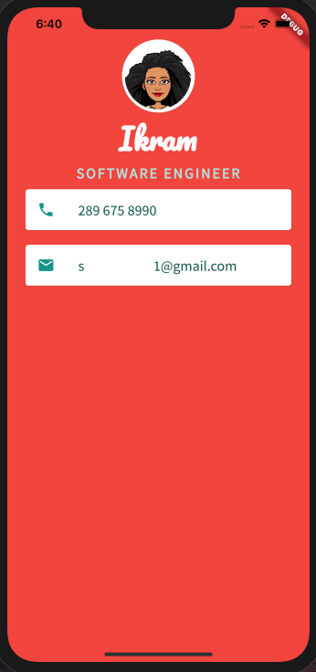

# Personal Business Card

## Getting Started

We will design the app's user interface by using stateless and layout widgets, Container class from flutter and design user interfaces for Flutter apps.

## What you will create

My Card is a personal business card with your phone number and email. 

*For help getting started with Flutter, view 
[online documentation](https://flutter.dev/docs), which offers tutorials,
samples, guidance on mobile development, and a full API reference.

*Icons used are from  [Material Design](https://www.materialpalette.com/)

  
  

# INSTALLATIONS

### X-code

### Android Studio 

### Flutter 

   

